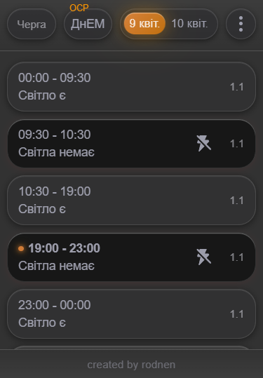
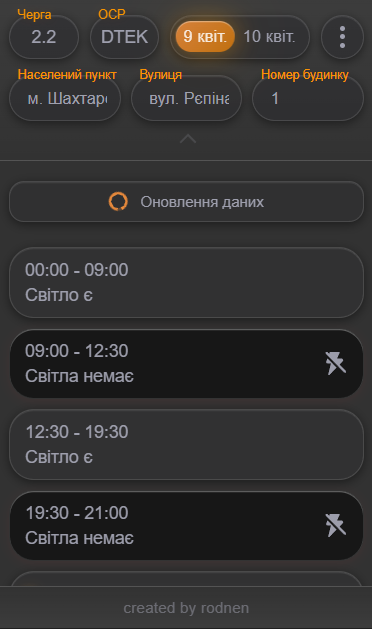
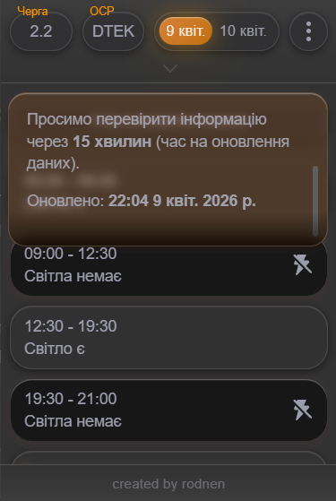

  
  
  

## 🔌 Розширення для графіків відключень в Ураїні (Yasno + DTEK)
Розширення для браузера, яке дозволяє швидко перевіряти графіки відключень електроенергії (блекаутів) в Україні, використовуючи офіційні дані від **Yasno** та **DTEK**.

## ⚡ Особливості
- 🔍 Отримайте графіки відключень електроенергії за кілька кліків
- 📊 Підтримка Yasno та DTEK
- ⚡ Швидкий та легкий
- 🧩 Працює в браузерах Chromium
- 🎯 Простий інтерфейс

---

# 🧩 Встановлення розширення (Chromium)

Інструкція з ручного встановлення для **браузерів на базі Chromium**  
_(Chrome, Edge, Brave, Opera, Vivaldi)_

---

## ✅ Вимоги
- Будь-який браузер на базі Chromium  
- Папка розширення з файлом `manifest.json`

---

## 🚀 Встановлення

### 1️⃣ Відкрийте сторінку розширень
- chrome://extensions/
- edge://extensions/
- opera://extensions/

---

### 2️⃣ Увімкніть режим розробника
Увімкніть **Developer mode / Режим розробника** (у правому верхньому куті, залежить від Браузера).

---

### 3️⃣ Завантажте розширення
1. Натисніть [**Завантажити**](https://github.com/rodnen/yasno-extension/releases/latest)
2. Оберіть папку з файлом `manifest.json`

✅ Розширення встановлено та готове до використання.

---

## 🔄 Оновлення
Після змін у файлах розширення:
- Перейдіть на сторінку розширень
- Натисніть **Reload / Оновити**

---

## 🗑️ Видалення
Сторінка розширень → **Remove / Видалити**

---

## ⚠️ Примітки
- **Не** переміщуйте та не видаляйте папку розширення після встановлення
- Розпаковані розширення **не проходять перевірку** Chrome Web Store
- Для роботи в режимі інкогніто потрібно вручну надати дозвіл
